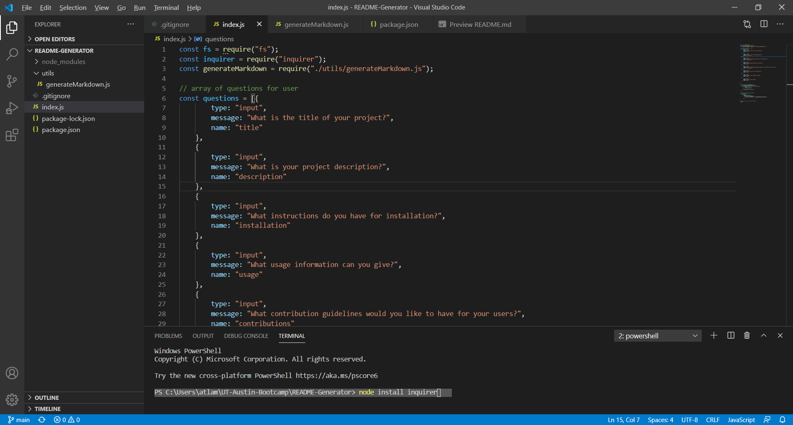
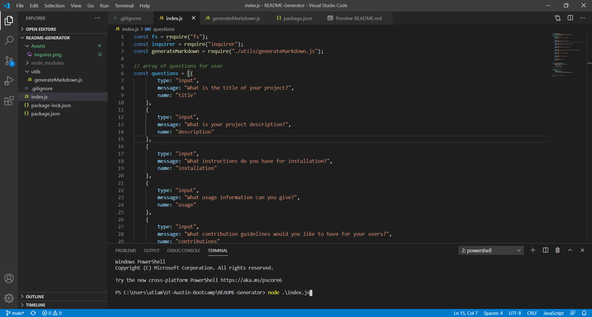

# README-Generator

## Description

The following application generates a README.md file by asking the user a series of prompts. The users answers get inputed into a template and creates a quality README page.

The following link is a video showing how the application is used through node.
https://drive.google.com/file/d/1HCDcy64hb6PBPnQYB7I7_uvLte7kpK95/view

## Instructions

The user must first make sure that inquirer is installed. They can do this through inputing npm install through the terminal. File System and the generateMarkdown modules should already be included.

The user will need to run "node index.js" through the terminal to start the prompts.

From here a series of prompts will be shown through the terminal for the user to answer. The answers willm then be input into a template and will generate the README.

##Question

For any questions, email me at atlambert11@gmail.com
